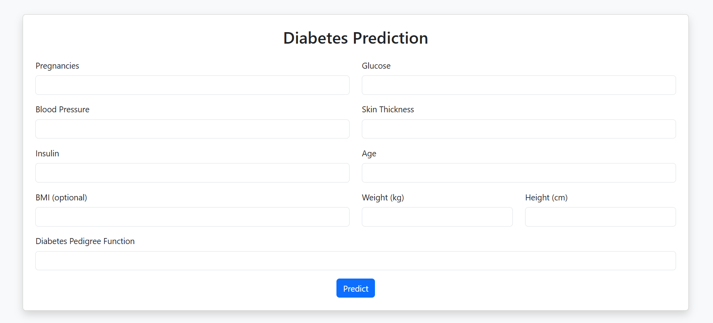
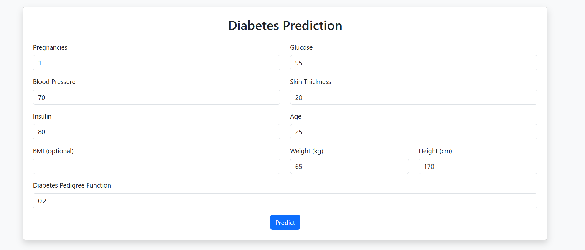
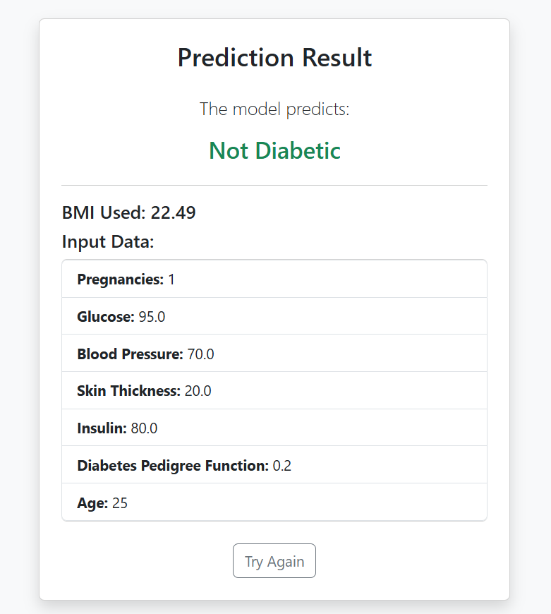
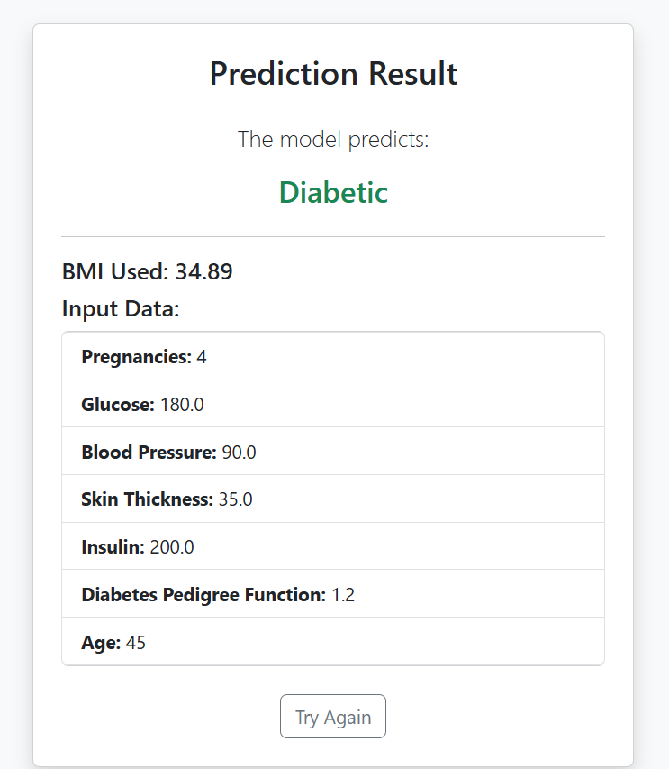

# 🩺 Diabetes Prediction Web App


## 🚀 Overview

Welcome to the **Diabetes Prediction Web App**! This project leverages machine learning to predict the likelihood of diabetes based on user input. Built with Flask and a Random Forest model, it provides a simple, interactive, and modern web interface for users to check their diabetes risk.

---

## ✨ Features

- 🧑‍⚕️ **User-Friendly Interface**: Clean and modern UI for easy data entry
- 🤖 **ML Powered**: Utilizes a trained Random Forest model for predictions
- 📊 **Real-Time Results**: Instant feedback on diabetes risk
- 🔒 **Secure & Lightweight**: No data is stored; privacy-focused

---

## 🖼️ Screenshots

> _Replace the image links below with your actual screenshots_

### 1. Home Page


### 2. Data Input Form


### 3. Prediction Result - 1


### 4. Prediction Result - 2


---

## 🛠️ Tech Stack

- **Backend:** Flask
- **Frontend:** HTML5, CSS3 (Jinja2 templates)
- **ML Model:** Random Forest (scikit-learn)
- **Deployment:** Localhost (can be deployed to Heroku, Render, etc.)

---

## 🚦 How to Run Locally

1. **Clone the repository**
   ```bash
   git clone https://github.com/yourusername/diabetes-prediction-app.git
   cd diabetes-prediction-app
   ```
2. **Install dependencies**
   ```bash
   pip install -r requirements.txt
   ```
3. **Run the app**
   ```bash
   python app.py
   ```
4. **Open in browser**
   - Visit [http://127.0.0.1:5000](http://127.0.0.1:5000)

---

## 📁 Project Structure

```
├── app.py                  # Main Flask application
├── requirements.txt        # Python dependencies
├── models/
│   ├── Diabetes_Prediction.ipynb  # Model training notebook
│   ├── diabetes_rf_model.pkl      # Trained model
│   └── diabetes_scaler.pkl        # Scaler for input data
├── static/                 # Static files (CSS, images)
├── templates/
│   ├── index.html          # Home page template
│   └── result.html         # Result page template
└── README.md               # Project documentation
```

---

## 🤝 Contributing

Contributions are welcome! Please open an issue or submit a pull request for improvements or bug fixes.

---

## 📄 License

This project is licensed under the MIT License.

---

## 🙋‍♂️ Contact

For questions or feedback, feel free to reach out:
- GitHub: Dinraj K Dinesh(https://github.com/dinraj910)
- Email: dinrajdinesh564@gmail.com

---

> ⭐️ _If you like this project, give it a star on GitHub!_
